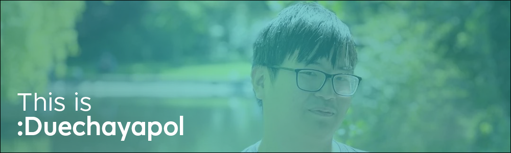

Hello! 👋 I am Due (he/him) and this is all the work from my time in Atlantic Technological University and my down time.

- 💬 Fourth Year Student in Atlantic Technological University (BSc Software Development)
- 🔨 Currently focused on Java Development (Minecraft plugin development, privately) and Development Operations.
- 🌱 This profile has a mixture of **everything**, but I recommend my on-going **dep-fitness** project with lads in college.
- 📫 You can reach out to me via my email ([duechayapolsbs@gmail.com](mailto:duechayapolsbs@gmail.com?subject=Hello)) or my LinkedIn profile! ([https://www.linkedin.com/in/chayapol-hongsrimuang-185487157/](https://www.linkedin.com/in/chayapol-hongsrimuang-185487157/))
- 🎮 I also work on other projects as well, especially on YouTube with my [MCC Live Show](https://www.youtube.com/channel/UC_Vi7BvymfOBn2AMwoUQVXw) project and a collaboration YouTube project of [MCC Centra](https://www.youtube.com/@mcc_central).

<!--
**duechayapolgmit/duechayapolgmit** is a ✨ _special_ ✨ repository because its `README.md` (this file) appears on your GitHub profile.

Here are some ideas to get you started:

- 🔭 I’m currently working on ...
- 🌱 I’m currently learning ...
- 👯 I’m looking to collaborate on ...
- 🤔 I’m looking for help with ...
- 💬 Ask me about ...
- 📫 How to reach me: ...
- 😄 Pronouns: ...
- ⚡ Fun fact: ...
-->
